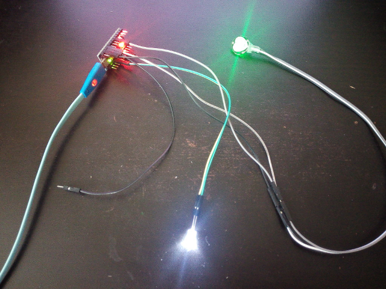
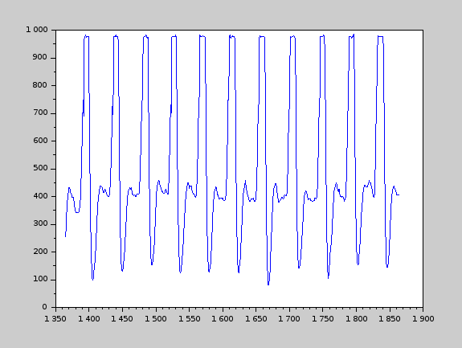

# PulseSensor Сapture

Содежрит исходные коды [Scilab](http://www.scilab.org) для получения и визуализации кардиосигнала с сенсора PulseSensor.

Arduino PulseSensor в сборе:

Визуализация полученного кардиосигнала:

